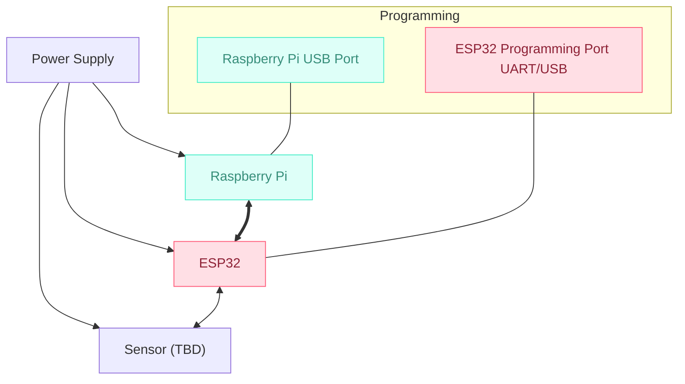
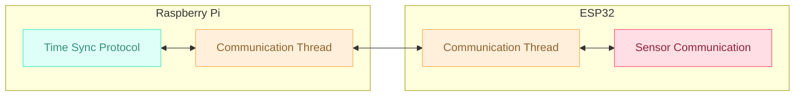
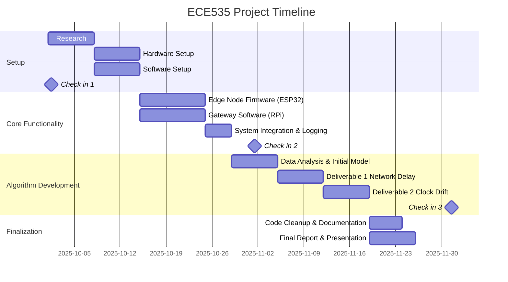

# ECE535 Final Project: Time Synchronization via Embedded Sensor Data
Aidan Chin, Robert Yao, Alexander Shub, Gerard DeCunha

## Motivation

Out of all the projects listed, this one stood out to our group as being the most suited for our areas of interest/expertise. We have lots of experience with basic microcontrollers such as the AVR platform and utilizing them for communication, so the task of creating a simple protocol seems like a natural extension of this interest. This is also a great opportunity for us to increase our knowledge and understand the way systems interact and the particular challenges that come with them. The project will also be a good exercise in networking separate systems on different platforms, namely edges with a central Pi running the algorithm. 

## Design Goals
- Develop a time synchronization protocol using timestamped sensor data from two embedded devices.
- The data will be transmitted to a Raspberry Pi, which will run the synchronization algorithm.
- Ensure accurate alignment of sensor events across devices despite network delay and clock drift.

## Deliverables

### • Hardware
- ESP32s connected to sensors

### • Software
- ESP32 Firmware: Sensor reading, timestamping, and transmission to Raspberry Pi
- Raspberry Pi Software: Data reception and synchronization algorithm

### • Documentation
- Setup and usage guide
- Final project report

### • Final Demonstration
- Live demo showing synchronized sensor data and protocol performance

## System Blocks

## HW/SW Requirements

| Component       | Purpose                                  |
|----------------|-------------------------------------------|
| ESP32           | Edge device for sensor data + timestamping |
| Raspberry Pi    | Central node for synchronization algorithm |
| Sensors         | Event generation for time sync testing     |
| C++             | ESP32 firmware development                 |
| Python          | Raspberry Pi software + algorithm          |

## Team Member Responsibilities

| Member           | Responsibilities                          |
|------------------|-------------------------------------------|
| Gerard DeCunha   | Software, writing, research                |
| Alexander Shub   | Networking, writing, research              |
| Aidan Chin       | Algorithm design, writing, hardware        |
| Robert Yao       | Setup, software, hardware                  |

## Project Timeline

## References
- HAEST: Harvesting Ambient Events to Synchronize Time across Heterogeneous IoT Devices
- Automated Synchronization of Driving Data Using Vibration and Steering Events
- Exploiting Smartphone Peripherals for Precise Time Synchronization
